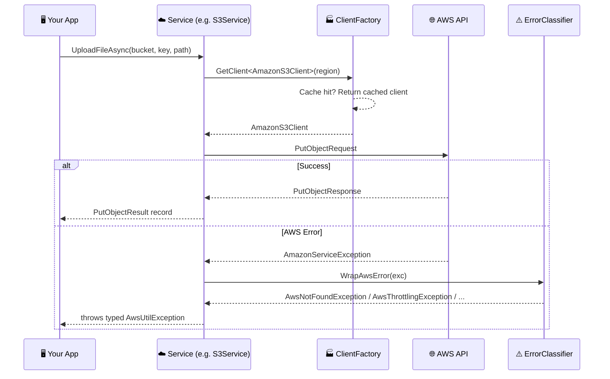
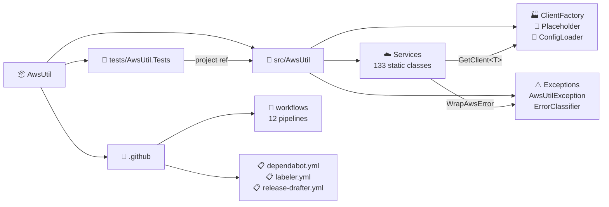
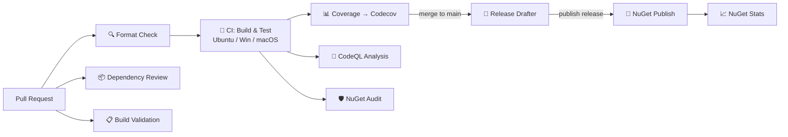

<!-- README auto-maintained. Update this file whenever: code structure changes,
     new env vars added, commands change, new workflows added, or deps updated. -->

<div align="center">

<!-- Animated Author Banner (external SVG — do not inline) -->
<a href="https://www.masrikdahir.com">
  
</a>

**[🌐 masrikdahir.com](https://www.masrikdahir.com)** · **[GitHub](https://github.com/Masrik-Dahir)**

</div>

<div align="center">

# ☁️ AwsUtil

> A comprehensive C# utility library wrapping 133 AWS services with cached clients, structured exceptions, placeholder resolution, and multi-service orchestration — the .NET port of [aws-util](https://github.com/Masrik-Dahir/aws-util-python).

[](https://github.com/Masrik-Dahir/aws-util-csharp/actions/workflows/ci.yml)
[](https://github.com/Masrik-Dahir/aws-util-csharp/actions/workflows/codeql.yml)
[](https://www.nuget.org/packages/AwsUtil)
[](https://www.nuget.org/packages/AwsUtil)
[](https://codecov.io/gh/Masrik-Dahir/aws-util-csharp)
[](https://opensource.org/licenses/MIT)
[](https://dotnet.microsoft.com/)

</div>

---

## 📋 Table of Contents

- [✨ Features](#-features)
- [🏗️ Architecture](#️-architecture)
- [📁 Project Structure](#-project-structure)
- [⚙️ Prerequisites](#️-prerequisites)
- [🚀 Quick Start](#-quick-start)
- [📖 Usage](#-usage)
- [🧪 Testing](#-testing)
- [🔄 CI/CD](#-cicd)
- [🤝 Contributing](#-contributing)
- [📝 Changelog](#-changelog)
- [📄 License](#-license)

---

## ✨ Features

- ☁️ **133 AWS Service Wrappers** — High-level, opinionated methods for S3, DynamoDB, Lambda, SQS, Bedrock, ECS, RDS, and 126 more services in a single NuGet package
- ⚡ **Cached Client Factory** — LRU cache with TTL-based eviction (15-minute default, max 64 clients) so STS temporary credentials and role rotations are picked up automatically
- 🔀 **Dual API Surface** — Every operation ships with both `async Task<T>` and synchronous overloads
- 🛡️ **Structured Exception Hierarchy** — AWS error codes classified into 6 semantic exception types (`AwsThrottlingException`, `AwsNotFoundException`, `AwsPermissionException`, `AwsConflictException`, `AwsValidationException`, `AwsTimeoutException`) plus a catch-all
- 🔑 **Placeholder Resolution** — Inline `${ssm:/path}` and `${secret:name:key}` references resolved from SSM Parameter Store and Secrets Manager with built-in caching
- 📦 **Config Loader** — Batch load application config from SSM parameter paths with optional Secrets Manager overlay, DB credential retrieval, and automatic placeholder resolution
- 🔗 **30+ Multi-Service Orchestrations** — Pre-built patterns for blue/green deploys, data pipelines, security ops, disaster recovery, cost governance, credential rotation, container ops, and more
- 🌍 **Cross-Platform CI** — Tested on Ubuntu, Windows, and macOS on every push via 12 GitHub Actions workflows

---

## 🏗️ Architecture

```mermaid
classDiagram
    direction TB

    class ClientFactory {
        <<static>>
        +GetClient~T~(region?) T
        +ClearCache() void
        -Cache : Dictionary~string, Entry~
        -DefaultTtl : 15min
        -MaxSize : 64
    }

    class ErrorClassifier {
        <<static>>
        +ClassifyAwsError(exc, msg) AwsUtilException
        +WrapAwsError(exc, msg) AwsUtilException
        -ThrottlingCodes : HashSet
        -NotFoundCodes : HashSet
        -PermissionCodes : HashSet
        -ConflictCodes : HashSet
        -ValidationCodes : HashSet
    }

    class AwsUtilException {
        +ErrorCode : string?
        +Message : string
    }
    AwsUtilException <|-- AwsThrottlingException
    AwsUtilException <|-- AwsNotFoundException
    AwsUtilException <|-- AwsPermissionException
    AwsUtilException <|-- AwsConflictException
    AwsUtilException <|-- AwsValidationException
    AwsUtilException <|-- AwsTimeoutException
    AwsUtilException <|-- AwsServiceException

    class Placeholder {
        <<static>>
        +Retrieve(value) object?
        +RetrieveAsync(value) Task~object?~
        +ClearAllCaches() void
        -SsmCache : ConcurrentDictionary
        -SecretCache : ConcurrentDictionary
    }

    class ConfigLoader {
        <<static>>
        +LoadAppConfigAsync(path, secret?) Task~AppConfig~
        +LoadConfigFromSsmAsync(path) Task~Dict~
        +LoadConfigFromSecretAsync(name) Task~Dict~
        +GetDbCredentialsAsync(name) Task~Dict~
        +ResolveConfigAsync(config) Task~Dict~
    }

    class AppConfig {
        +Get(key, default?) object?
        +ContainsKey(key) bool
        +Values : IReadOnlyDictionary
    }

    class S3Service {
        <<static>>
        +UploadFileAsync(...)
        +DownloadBytesAsync(...)
        +ListObjectsAsync(...)
        +GeneratePresignedUrl(...)
    }

    class DynamoDbService {
        <<static>>
        +PutItemAsync(...)
        +GetItemAsync(...)
        +QueryAsync(...)
    }

    class «133 Services» {
        <<static>>
        SQS, Lambda, SNS, SES,
        ECS, EKS, Bedrock, ...
    }

    ConfigLoader --> Placeholder : resolves values
    ConfigLoader ..> AppConfig : creates
    Placeholder --> ParameterStoreService : SSM lookups
    Placeholder --> SecretsManagerService : secret lookups
    S3Service --> ClientFactory : GetClient
    DynamoDbService --> ClientFactory : GetClient
    «133 Services» --> ClientFactory : GetClient
    S3Service --> ErrorClassifier : WrapAwsError
    DynamoDbService --> ErrorClassifier : WrapAwsError
    «133 Services» --> ErrorClassifier : WrapAwsError

    note for ClientFactory "LRU cache per (type, region)\nTTL evicts stale clients\nMax 64 concurrent clients"
```

### Request Flow



---

## 📁 Project Structure

```
📦 AwsUtil/
├── 📁 .github/
│   ├── 📁 workflows/              # 12 CI/CD pipelines
│   │   ├── ci.yml                 # Build & test (Ubuntu, Windows, macOS)
│   │   ├── coverage.yml           # Code coverage → Codecov
│   │   ├── codeql.yml             # Security analysis
│   │   ├── dotnet-format.yml      # Format enforcement
│   │   ├── build-validation.yml   # NuGet pack validation
│   │   ├── nuget-audit.yml        # Dependency vulnerability scan
│   │   ├── nuget-publish.yml      # Publish to nuget.org
│   │   ├── nuget-stats.yml        # Weekly download stats
│   │   ├── dependency-review.yml  # Block high-severity/GPL deps
│   │   ├── release-drafter.yml    # Auto-draft release notes
│   │   ├── repo-stats.yml         # GitHub traffic archival
│   │   └── stale.yml              # Auto-close inactive issues/PRs
│   ├── 🎨 banner.svg              # Animated author banner
│   ├── 📋 dependabot.yml          # Weekly NuGet + Actions updates
│   ├── 📋 labeler.yml             # Auto-label PRs
│   └── 📋 release-drafter.yml     # Release notes template
├── 📁 src/
│   └── 📁 AwsUtil/
│       ├── ⚙️ AwsUtil.csproj       # NuGet package (125 AWS SDK refs)
│       ├── 🏭 ClientFactory.cs      # LRU cached client factory (TTL 15min, max 64)
│       ├── 🔧 ConfigLoader.cs       # Batch config from SSM + Secrets Manager
│       ├── 🔑 Placeholder.cs        # ${ssm:...} / ${secret:...} resolution
│       ├── 📁 Exceptions/
│       │   ├── ⚠️ AwsUtilException.cs  # Base + 6 typed exception subclasses
│       │   └── 🏷️ ErrorClassifier.cs   # AWS error code → exception mapping
│       └── 📁 Services/
│           └── ☁️ *.cs              # 133 service files (one per service)
├── 📁 tests/
│   └── 📁 AwsUtil.Tests/
│       ├── ⚙️ AwsUtil.Tests.csproj  # xUnit + Moq + coverlet
│       ├── 🧪 ClientFactoryTests.cs
│       ├── 🧪 ExceptionsTests.cs
│       └── 🧪 PlaceholderTests.cs
├── 📋 AwsUtil.slnx                  # Solution file (.slnx format)
├── 📋 CHANGELOG.md
└── 📖 README.md
```



---

## ⚙️ Prerequisites

Before you begin, make sure you have the following installed:

| Tool | Version | Install |
|------|---------|---------|
| .NET SDK | ≥ 10.0 | [dotnet.microsoft.com](https://dotnet.microsoft.com/download) |
| AWS Credentials | — | [AWS CLI](https://aws.amazon.com/cli/), env vars, or IAM role |

> 💡 **Tip:** Credentials can be provided via environment variables (`AWS_ACCESS_KEY_ID`, `AWS_SECRET_ACCESS_KEY`, `AWS_SESSION_TOKEN`), the shared credentials file (`~/.aws/credentials`), or an IAM role when running on AWS infrastructure (EC2, ECS, Lambda).

---

## 🚀 Quick Start

### 1. Install the NuGet package

```bash
dotnet add package AwsUtil
# Expected output: info : PackageReference for package 'AwsUtil' version '2.2.6' added
```

Or add directly to your `.csproj`:

```xml
<PackageReference Include="AwsUtil" Version="2.2.6" />
```

### 2. Build from source (optional)

```bash
git clone https://github.com/Masrik-Dahir/aws-util-csharp.git
cd aws-util-csharp
dotnet restore
dotnet build --configuration Release
# Build succeeded. 0 Warning(s) 0 Error(s)
```

### 3. Use a service

```csharp
using AwsUtil;
using AwsUtil.Services;

// ── Placeholder resolution (SSM + Secrets Manager) ──
var dbHost = (string)Placeholder.Retrieve("${ssm:/myapp/db/host}")!;
var dbPass = (string)Placeholder.Retrieve("${secret:myapp/db-credentials:password}")!;

// ── S3 operations ──
await S3Service.UploadFileAsync("my-bucket", "data/file.json", "/tmp/file.json");
var bytes = await S3Service.DownloadBytesAsync("my-bucket", "data/file.json");
var url   = S3Service.GeneratePresignedUrl("my-bucket", "data/file.json", expiresIn: 3600);

// ── SQS operations ──
await SqsService.SendMessageAsync(
    "https://sqs.us-east-1.amazonaws.com/123/my-queue", "hello");
var messages = await SqsService.ReceiveMessagesAsync(
    "https://sqs.us-east-1.amazonaws.com/123/my-queue");

// ── DynamoDB operations ──
await DynamoDbService.PutItemAsync("my-table", item);
var result = await DynamoDbService.GetItemAsync("my-table", key);

// ── Secrets Manager ──
var secret = await SecretsManagerService.GetSecretAsync("myapp/db-credentials:password");

// ── Parameter Store ──
var param = await ParameterStoreService.GetParameterAsync("/myapp/config/db-host",
    withDecryption: true);
```

### 4. Multi-service orchestration

```csharp
// ── Batch config loading from SSM + Secrets Manager ──
var config = await ConfigLoader.LoadAppConfigAsync(
    "/myapp/prod/", secretName: "myapp/secrets");
var dbUrl = config.Get("database-url");

// ── DB credentials from Secrets Manager ──
var creds = await ConfigLoader.GetDbCredentialsAsync("myapp/db-creds");

// ── Notifications across SNS, SES, SQS ──
var result = await NotifierService.BroadcastAsync(
    "Alert", "Something happened",
    snsTopicArns: new() { "arn:aws:sns:us-east-1:123:alerts" });

// ── Exception-aware notifications ──
await NotifierService.NotifyOnExceptionAsync(
    async () => await SomeRiskyOperation(),
    "arn:aws:sns:us-east-1:123:errors");
```

---

## 📖 Usage

### Exception Handling

All AWS errors are mapped to semantic exception types via `ErrorClassifier`:

| Exception | Example AWS Error Codes |
|-----------|------------------------|
| `AwsThrottlingException` | `Throttling`, `TooManyRequestsException`, `LimitExceededException`, `SlowDown` |
| `AwsNotFoundException` | `ResourceNotFoundException`, `NoSuchKey`, `NoSuchBucket`, `QueueDoesNotExist` |
| `AwsPermissionException` | `AccessDenied`, `UnauthorizedOperation`, `AuthFailure`, `ExpiredToken` |
| `AwsConflictException` | `ConflictException`, `AlreadyExistsException`, `ConditionalCheckFailedException` |
| `AwsValidationException` | `ValidationException`, `InvalidParameterValue`, `InvalidInput` |
| `AwsTimeoutException` | Operation timeout |
| `AwsServiceException` | Catch-all for unclassified errors |

All inherit from `AwsUtilException` → `Exception`.

```csharp
try
{
    await S3Service.DownloadBytesAsync("my-bucket", "missing-key");
}
catch (AwsNotFoundException ex)
{
    Console.WriteLine($"Not found: {ex.ErrorCode}");  // "NoSuchKey"
}
catch (AwsThrottlingException)
{
    // Back off and retry
}
catch (AwsUtilException ex)
{
    // Catch-all for any classified AWS error
    Console.WriteLine($"{ex.GetType().Name}: {ex.Message} [{ex.ErrorCode}]");
}
```

### Placeholder Resolution

Resolve AWS references embedded in configuration strings:

```csharp
// SSM Parameter Store
var host = (string)Placeholder.Retrieve("${ssm:/myapp/db/host}")!;

// Secrets Manager (full secret)
var secret = (string)Placeholder.Retrieve("${secret:myapp/api-key}")!;

// Secrets Manager (JSON key extraction)
var password = (string)Placeholder.Retrieve("${secret:myapp/db-creds:password}")!;

// Async version
var value = await Placeholder.RetrieveAsync("${ssm:/myapp/config}");

// Results are cached — clear when needed
Placeholder.ClearAllCaches();
```

### Service Coverage

<details>
<summary><strong>Core Services</strong></summary>

S3, SQS, DynamoDB, Lambda, SNS, SES (v1 & v2), Parameter Store, Secrets Manager, KMS, STS, IAM, EC2

</details>

<details>
<summary><strong>Compute & Containers</strong></summary>

ECS, ECR, EKS, Lambda, Batch, App Runner, Elastic Beanstalk, Lightsail, EMR, EMR Containers, EMR Serverless

</details>

<details>
<summary><strong>Database & Storage</strong></summary>

RDS, DynamoDB, ElastiCache, Neptune, Neptune Graph, Keyspaces, MemoryDB, DocumentDB, Redshift, Redshift Data, Redshift Serverless, EFS, FSx, Storage Gateway, Transfer, Timestream Write/Query, RDS Data

</details>

<details>
<summary><strong>Networking & CDN</strong></summary>

Route 53, CloudFront, ELBv2, VPC Lattice, Auto Scaling

</details>

<details>
<summary><strong>AI/ML</strong></summary>

Bedrock, Bedrock Agent, Bedrock Agent Runtime, SageMaker Runtime, SageMaker Feature Store, Rekognition, Textract, Comprehend, Translate, Polly, Transcribe, Personalize, Personalize Runtime, Forecast, Forecast Query, Lex Models, Lex Runtime

</details>

<details>
<summary><strong>Analytics</strong></summary>

Athena, Glue, Kinesis, Kinesis Firehose, Kinesis Analytics, MSK, QuickSight, DataBrew

</details>

<details>
<summary><strong>Security & Compliance</strong></summary>

Security Hub, Inspector, Detective, Macie, Access Analyzer, SSO Admin, Cognito, Cognito Identity

</details>

<details>
<summary><strong>Management & Governance</strong></summary>

CloudWatch, CloudTrail, CloudFormation, EventBridge, Step Functions, Organizations, Service Quotas, Config Service, Health

</details>

<details>
<summary><strong>Developer Tools</strong></summary>

CodeBuild, CodeCommit, CodeDeploy, CodePipeline, CodeArtifact, CodeStar Connections

</details>

<details>
<summary><strong>IoT</strong></summary>

IoT Core, IoT Data, IoT Greengrass, IoT SiteWise

</details>

<details>
<summary><strong>Media & Communication</strong></summary>

MediaConvert, IVS, Connect

</details>

<details>
<summary><strong>Multi-Service Orchestration (30+ patterns)</strong></summary>

Deployer, Data Pipeline, Resource Ops, Security Ops, Lambda Middleware, API Gateway, Event Orchestration, Data Flow ETL, Resilience, Observability, Deployment, Security Compliance, Cost Optimization, Testing & Dev, Config State, Messaging, AI/ML Pipelines, Infra Automation, Cross-Account, Blue/Green, Data Lake, Event Patterns, Container Ops, Cost Governance, Credential Rotation, Database Migration, Disaster Recovery, ML Pipeline, Networking, Security Automation

</details>

---

## 🧪 Testing

```bash
# Run all tests
dotnet test --configuration Release --verbosity normal

# Run with coverage report
dotnet test --configuration Release \
  --collect:"XPlat Code Coverage" \
  --results-directory ./coverage

# Check code formatting (CI enforces this)
dotnet format --verify-no-changes
```

Tests use **xUnit** with **Moq** for mocking and **coverlet** for code coverage. Reports are uploaded to [Codecov](https://codecov.io/gh/Masrik-Dahir/aws-util-csharp).

---

## 🔄 CI/CD

This project uses **12 GitHub Actions workflows** for automated testing, security analysis, and publishing.

| Workflow | Trigger | Purpose |
|----------|---------|---------|
| `ci.yml` | Push & PR to main/master/develop | Build & test on Ubuntu, Windows, macOS |
| `coverage.yml` | Push & PR to main/master | Code coverage → Codecov |
| `codeql.yml` | Push & PR to main/master + weekly | GitHub security analysis for C# |
| `dotnet-format.yml` | PR to main/master/develop | Enforce consistent code formatting |
| `build-validation.yml` | PR to main/master | Validate NuGet package packs with warnings-as-errors |
| `nuget-audit.yml` | Push & PR to main/master + weekly | Scan 125 dependencies for vulnerabilities & deprecations |
| `nuget-publish.yml` | GitHub release published | Pack and push to nuget.org |
| `nuget-stats.yml` | Weekly + manual | Collect NuGet download counts per version |
| `dependency-review.yml` | PR to main/master | Block PRs introducing high-severity or GPL deps |
| `release-drafter.yml` | Push to main/master | Auto-draft release notes from merged PRs |
| `repo-stats.yml` | Daily | Archive GitHub traffic (views, clones, referrers) |
| `stale.yml` | Daily | Auto-close inactive issues (60d) and PRs (30d) |

### Pipeline Flow



> All checks must pass before merging. Dependabot sends weekly PRs for NuGet and GitHub Actions updates. See [`.github/workflows/`](.github/workflows/) for full configuration.

---

## 🤝 Contributing

Contributions are welcome! Please follow these steps:

1. **Fork** the repository
2. **Create** a feature branch: `git checkout -b feat/amazing-feature`
3. **Commit** your changes: `git commit -m 'feat: add amazing feature'`
4. **Push** to the branch: `git push origin feat/amazing-feature`
5. **Open** a Pull Request

### Commit Convention

This project uses [Conventional Commits](https://www.conventionalcommits.org/):

| Prefix | Use for |
|--------|---------|
| `feat:` | New features |
| `fix:` | Bug fixes |
| `docs:` | Documentation only |
| `ci:` | CI/CD changes |
| `chore:` | Build / tooling changes |
| `test:` | Adding or fixing tests |

> Please ensure all tests pass and `dotnet format --verify-no-changes` succeeds before opening a PR.

---

## 📝 Changelog

| Version | Date | Changes |
|---------|------|---------|
| v2.2.6 | 2026-04-09 | Initial C# port — 133 service wrappers, cached client factory, exception hierarchy, placeholder resolution, config loader |

See [`CHANGELOG.md`](CHANGELOG.md) for the full log.

---

## 📄 License

Distributed under the MIT License. See [`LICENSE`](LICENSE) for more information.

---

<div align="center">

Made with ❤️ by **[Masrik Dahir](https://www.masrikdahir.com)**

⭐ Star this repo if you find it helpful!

[](https://github.com/sponsors/Masrik-Dahir)

</div>
