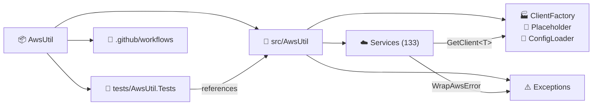
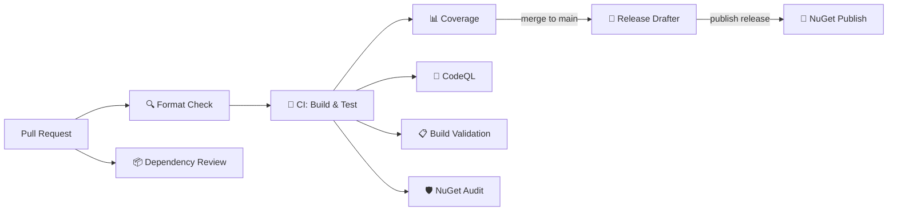

<!-- README auto-maintained. Update this file whenever: code structure changes,
     new env vars added, commands change, new workflows added, or deps updated. -->

<div align="center">

<!-- Animated Author Banner (external SVG — do not inline) -->
<a href="https://www.masrikdahir.com">
  
</a>

**[🌐 masrikdahir.com](https://www.masrikdahir.com)** · **[GitHub](https://github.com/Masrik-Dahir)**

</div>

<div align="center">

# 🚀 AwsUtil

> A comprehensive C# utility library wrapping 100+ AWS services with cached clients, structured exceptions, and multi-service orchestration patterns.

[](https://github.com/Masrik-Dahir/aws-util-csharp/actions/workflows/ci.yml)
[](https://github.com/Masrik-Dahir/aws-util-csharp/actions/workflows/codeql.yml)
[](https://www.nuget.org/packages/AwsUtil)
[](https://www.nuget.org/packages/AwsUtil)
[](https://codecov.io/gh/Masrik-Dahir/aws-util-csharp)
[](https://opensource.org/licenses/MIT)
[](https://dotnet.microsoft.com/)

</div>

---

## 📋 Table of Contents

- [✨ Features](#-features)
- [🏗️ Architecture](#️-architecture)
- [📁 Project Structure](#-project-structure)
- [⚙️ Prerequisites](#️-prerequisites)
- [🚀 Quick Start](#-quick-start)
- [📖 Usage](#-usage)
- [🧪 Testing](#-testing)
- [🔄 CI/CD](#-cicd)
- [🤝 Contributing](#-contributing)
- [📝 Changelog](#-changelog)
- [📄 License](#-license)

---

## ✨ Features

- ☁️ **133 AWS Service Wrappers** — High-level, opinionated methods for S3, DynamoDB, Lambda, SQS, Bedrock, and 128 more services
- ⚡ **Cached Client Factory** — TTL-based eviction (15-minute default) so STS temp credentials and role rotations are picked up automatically
- 🔀 **Dual API Surface** — Every operation ships with both `async Task<T>` and synchronous overloads
- 🛡️ **Structured Exception Hierarchy** — AWS error codes mapped to 6 semantic exception types (`AwsThrottlingException`, `AwsNotFoundException`, etc.)
- 🔑 **Placeholder Resolution** — Inline `${ssm:/path}` and `${secret:name:key}` references resolved from SSM Parameter Store and Secrets Manager
- 📦 **Config Loader** — Batch load application config from SSM + Secrets Manager in a single call
- 🔗 **Multi-Service Orchestration** — Pre-built patterns for blue/green deploys, data pipelines, security ops, disaster recovery, cost governance, and more
- 🌍 **Cross-Platform CI** — Tested on Ubuntu, Windows, and macOS across every push

---

## 🏗️ Architecture

```mermaid
classDiagram
    class ClientFactory {
        <<static>>
        +GetClient~T~(region?) T
        +ClearCache() void
        -Cache Dictionary
        -DefaultTtl TimeSpan
    }

    class ErrorClassifier {
        <<static>>
        +ClassifyAwsError(exc, msg) AwsUtilException
        +WrapAwsError(exc, msg) AwsUtilException
    }

    class AwsUtilException {
        +ErrorCode string?
    }
    AwsUtilException <|-- AwsThrottlingException
    AwsUtilException <|-- AwsNotFoundException
    AwsUtilException <|-- AwsPermissionException
    AwsUtilException <|-- AwsConflictException
    AwsUtilException <|-- AwsValidationException
    AwsUtilException <|-- AwsTimeoutException
    AwsUtilException <|-- AwsServiceException

    class Placeholder {
        <<static>>
        +Retrieve(template) object?
    }

    class ConfigLoader {
        <<static>>
        +LoadAppConfigAsync(prefix, secretName) Task
    }

    class S3Service {
        <<static>>
        +UploadFileAsync(...)
        +DownloadBytesAsync(...)
        +ListObjectsAsync(...)
    }

    class SqsService {
        <<static>>
        +SendMessageAsync(...)
        +ReceiveMessagesAsync(...)
    }

    class DynamoDbService {
        <<static>>
        +PutItemAsync(...)
        +GetItemAsync(...)
    }

    S3Service --> ClientFactory : GetClient~AmazonS3Client~
    SqsService --> ClientFactory : GetClient~AmazonSQSClient~
    DynamoDbService --> ClientFactory : GetClient~AmazonDynamoDBClient~
    S3Service --> ErrorClassifier : WrapAwsError
    SqsService --> ErrorClassifier : WrapAwsError
    DynamoDbService --> ErrorClassifier : WrapAwsError

    note for ClientFactory "All 133 service classes\nacquire clients through\nthis cached factory"
```



---

## 📁 Project Structure

```
📦 AwsUtil/
├── 📁 .github/
│   ├── 📁 workflows/          # 12 CI/CD pipelines
│   ├── 🎨 banner.svg          # Animated author banner
│   ├── 📋 dependabot.yml      # Dependency updates
│   └── 📋 release-drafter.yml # Auto-draft release notes
├── 📁 src/
│   └── 📁 AwsUtil/
│       ├── ⚙️ AwsUtil.csproj       # NuGet package definition (125 AWS SDK refs)
│       ├── 🏭 ClientFactory.cs      # Cached AWS client factory (TTL 15min, max 64)
│       ├── 🔧 ConfigLoader.cs       # App config from SSM + Secrets Manager
│       ├── 🔑 Placeholder.cs        # SSM/Secrets placeholder resolution
│       ├── 📁 Exceptions/
│       │   ├── ⚠️ AwsUtilException.cs  # Base + 6 exception subtypes
│       │   └── 🏷️ ErrorClassifier.cs   # AWS error code → exception mapping
│       └── 📁 Services/
│           └── ☁️ *.cs              # 133 service files
├── 📁 tests/
│   └── 📁 AwsUtil.Tests/
│       ├── ⚙️ AwsUtil.Tests.csproj  # xUnit + Moq + coverlet
│       ├── 🧪 ClientFactoryTests.cs
│       ├── 🧪 ExceptionsTests.cs
│       └── 🧪 PlaceholderTests.cs
├── 📋 AwsUtil.slnx                  # Solution file (.slnx format)
├── 📋 CHANGELOG.md
└── 📖 README.md
```



---

## ⚙️ Prerequisites

Before you begin, make sure you have the following installed:

| Tool | Version | Install |
|------|---------|---------|
| .NET SDK | ≥ 10.0 | [dotnet.microsoft.com](https://dotnet.microsoft.com/download) |
| AWS Credentials | — | [AWS CLI](https://aws.amazon.com/cli/) or env vars / IAM role |

> 💡 **Tip:** Credentials can be provided via environment variables (`AWS_ACCESS_KEY_ID`, `AWS_SECRET_ACCESS_KEY`), the AWS config file (`~/.aws/credentials`), or an IAM role when running on AWS infrastructure.

---

## 🚀 Quick Start

### 1. Install the NuGet package

```bash
dotnet add package AwsUtil
```

Or add to your `.csproj`:

```xml
<PackageReference Include="AwsUtil" Version="2.2.6" />
```

### 2. Use a service

```csharp
using AwsUtil;
using AwsUtil.Services;

// Placeholder resolution (SSM + Secrets Manager)
var dbHost = (string)Placeholder.Retrieve("${ssm:/myapp/db/host}")!;
var dbPass = (string)Placeholder.Retrieve("${secret:myapp/db-credentials:password}")!;

// S3 operations
await S3Service.UploadFileAsync("my-bucket", "data/file.json", "/tmp/file.json");
var bytes = await S3Service.DownloadBytesAsync("my-bucket", "data/file.json");

// SQS operations
await SqsService.SendMessageAsync(
    "https://sqs.us-east-1.amazonaws.com/123/my-queue", "hello");

// DynamoDB operations
await DynamoDbService.PutItemAsync("my-table", item);
var result = await DynamoDbService.GetItemAsync("my-table", key);
```

### 3. Multi-service orchestration

```csharp
// Config loading from SSM + Secrets Manager
var config = await ConfigLoader.LoadAppConfigAsync("/myapp/prod/", secretName: "myapp/secrets");

// Notifications across SNS, SES, SQS
var result = await NotifierService.BroadcastAsync(
    "Alert", "Something happened",
    snsTopicArns: new() { "arn:aws:sns:us-east-1:123:alerts" });

// Exception-aware notifications
await NotifierService.NotifyOnExceptionAsync(
    async () => await SomeRiskyOperation(),
    "arn:aws:sns:us-east-1:123:errors");
```

---

## 📖 Usage

### Exception Handling

All AWS errors are mapped to semantic exception types:

| Exception | AWS Error Codes |
|-----------|----------------|
| `AwsThrottlingException` | Throttling, TooManyRequestsException, LimitExceededException, ... |
| `AwsNotFoundException` | ResourceNotFoundException, NoSuchKey, NoSuchBucket, ... |
| `AwsPermissionException` | AccessDenied, UnauthorizedOperation, AuthFailure, ... |
| `AwsConflictException` | ConflictException, AlreadyExistsException, ConditionalCheckFailedException, ... |
| `AwsValidationException` | ValidationException, InvalidParameterValue, InvalidInput, ... |
| `AwsTimeoutException` | Operation timeout |
| `AwsServiceException` | Catch-all for other errors |

All inherit from `AwsUtilException`, which inherits from `Exception`.

```csharp
try
{
    await S3Service.DownloadBytesAsync("my-bucket", "missing-key");
}
catch (AwsNotFoundException ex)
{
    Console.WriteLine($"Not found: {ex.ErrorCode}");
}
catch (AwsThrottlingException)
{
    // Back off and retry
}
catch (AwsUtilException ex)
{
    // Catch-all for any AWS error
}
```

### Service Coverage

**Core:** S3, SQS, DynamoDB, Lambda, SNS, SES (v1 & v2), Parameter Store, Secrets Manager, KMS, STS, IAM, EC2

**Compute & Containers:** ECS, ECR, EKS, Lambda, Batch, App Runner, Elastic Beanstalk, Lightsail, EMR, EMR Containers, EMR Serverless

**Database & Storage:** RDS, DynamoDB, ElastiCache, Neptune, Neptune Graph, Keyspaces, MemoryDB, DocumentDB, Redshift, Redshift Data, Redshift Serverless, EFS, FSx, Storage Gateway, Transfer, Timestream Write/Query, RDS Data

**Networking & CDN:** Route 53, CloudFront, ELBv2, VPC Lattice, Auto Scaling

**AI/ML:** Bedrock, Bedrock Agent, Bedrock Agent Runtime, SageMaker Runtime, SageMaker Feature Store, Rekognition, Textract, Comprehend, Translate, Polly, Transcribe, Personalize, Forecast, Lex

**Analytics:** Athena, Glue, Kinesis, Kinesis Firehose, Kinesis Analytics, MSK, QuickSight, DataBrew

**Security & Compliance:** Security Hub, Inspector, Detective, Macie, Access Analyzer, SSO Admin, Cognito, Cognito Identity

**Management & Governance:** CloudWatch, CloudTrail, CloudFormation, EventBridge, Step Functions, Organizations, Service Quotas, Config Service, Health

**Developer Tools:** CodeBuild, CodeCommit, CodeDeploy, CodePipeline, CodeArtifact, CodeStar Connections

**IoT:** IoT Core, IoT Data, IoT Greengrass, IoT SiteWise

**Media & Communication:** MediaConvert, IVS, Connect

**Multi-Service Orchestration:** Deployer, Data Pipeline, Resource Ops, Security Ops, Lambda Middleware, API Gateway, Event Orchestration, Data Flow ETL, Resilience, Observability, Deployment, Security Compliance, Cost Optimization, Testing & Dev, Config State, Messaging, AI/ML Pipelines, Infra Automation, Cross-Account, Blue/Green, Data Lake, Event Patterns, Container Ops, Cost Governance, Credential Rotation, Database Migration, Disaster Recovery, ML Pipeline, Networking, Security Automation

---

## 🧪 Testing

```bash
# Run all tests
dotnet test --configuration Release --verbosity normal

# Run with coverage report
dotnet test --configuration Release --collect:"XPlat Code Coverage" --results-directory ./coverage

# Check code formatting
dotnet format --verify-no-changes
```

Tests use **xUnit** with **Moq** for mocking and **coverlet** for code coverage. Coverage reports are uploaded to [Codecov](https://codecov.io/gh/Masrik-Dahir/aws-util-csharp).

---

## 🔄 CI/CD

This project uses GitHub Actions for automated testing, building, and deployment.

| Workflow | Trigger | Purpose |
|----------|---------|---------|
| `ci.yml` | Push & PR to main/master/develop | Build & test on Ubuntu, Windows, macOS |
| `coverage.yml` | Push & PR to main/master | Generate coverage report → Codecov |
| `codeql.yml` | Push & PR to main/master + weekly | GitHub security analysis for C# |
| `dotnet-format.yml` | PR to main/master/develop | Enforce consistent code formatting |
| `build-validation.yml` | PR to main/master | Validate NuGet package packs with warnings-as-errors |
| `nuget-audit.yml` | Push & PR to main/master + weekly | Scan 125 dependencies for vulnerabilities |
| `nuget-publish.yml` | GitHub release published | Pack and push to nuget.org |
| `dependency-review.yml` | PR to main/master | Block PRs introducing high-severity or GPL deps |
| `release-drafter.yml` | Push to main/master | Auto-draft release notes from merged PRs |
| `stale.yml` | Daily | Auto-close inactive issues (60d) and PRs (30d) |

### Pipeline Flow



> All checks must pass before merging. See [`.github/workflows/`](.github/workflows/) for full configuration.

---

## 🤝 Contributing

Contributions are welcome! Please follow these steps:

1. **Fork** the repository
2. **Create** a feature branch: `git checkout -b feat/amazing-feature`
3. **Commit** your changes: `git commit -m 'feat: add amazing feature'`
4. **Push** to the branch: `git push origin feat/amazing-feature`
5. **Open** a Pull Request

### Commit Convention

This project uses [Conventional Commits](https://www.conventionalcommits.org/):

| Prefix | Use for |
|--------|---------|
| `feat:` | New features |
| `fix:` | Bug fixes |
| `docs:` | Documentation only |
| `ci:` | CI/CD changes |
| `chore:` | Build / tooling changes |
| `test:` | Adding or fixing tests |

> Please ensure all tests pass and coverage does not decrease before opening a PR.

---

## 📝 Changelog

| Version | Date | Changes |
|---------|------|---------|
| v2.2.6 | 2026-04-09 | Initial C# port — 133 service wrappers, cached client factory, exception hierarchy, placeholder resolution, config loader |

See [`CHANGELOG.md`](CHANGELOG.md) for the full log.

---

## 📄 License

Distributed under the MIT License. See [`LICENSE`](LICENSE) for more information.

---

<div align="center">

Made with ❤️ by **[Masrik Dahir](https://www.masrikdahir.com)**

⭐ Star this repo if you find it helpful!

</div>
